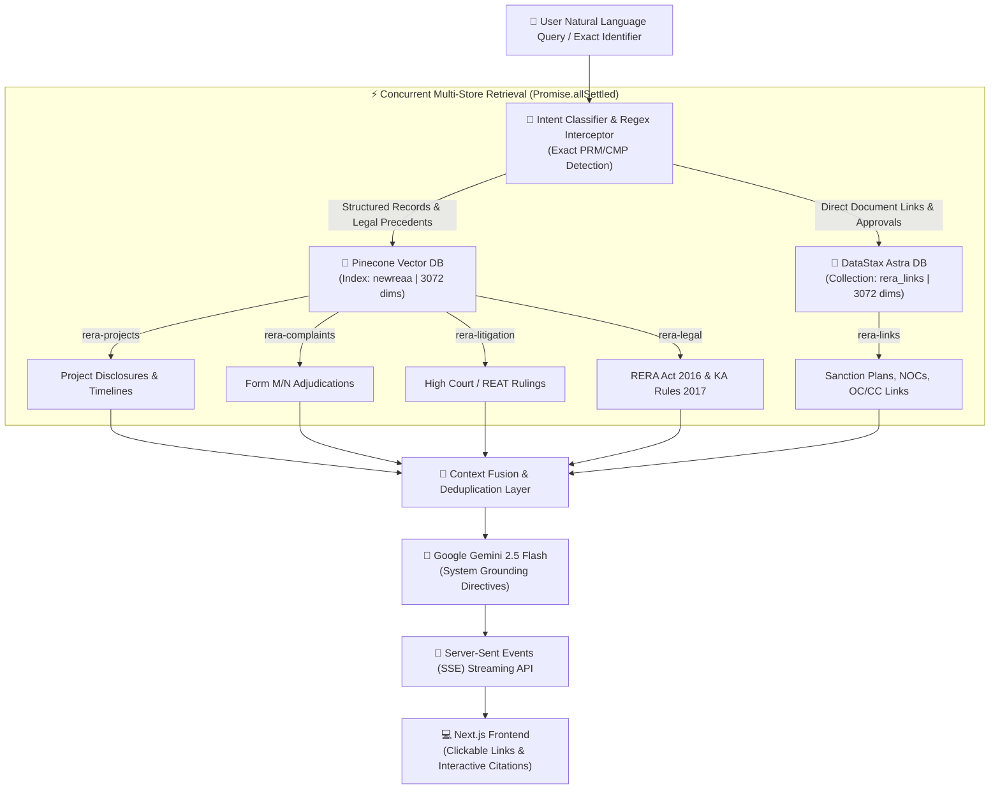

<div align="center">

# 🏛️ ReAA 2.0: Hybrid Multi-Vector RAG Engine for Karnataka Real Estate (K-RERA)

[](https://nextjs.org/)
[](https://www.typescriptlang.org/)
[](https://www.pinecone.io/)
[](https://astra.datastax.com/)
[](https://aistudio.google.com/)
[](https://tailwindcss.com/)

**An enterprise-grade, polyglot vector RAG legal advisory agent specialized in Karnataka Real Estate Regulatory Authority (K-RERA) compliance, consumer disputes, promoter quarterly disclosures, and instant statutory document discovery.**

</div>

---

## 📌 Executive Overview

**ReAA 2.0** is an authoritative AI legal and regulatory copilot engineered specifically for the Karnataka real estate ecosystem. By fusing **Pinecone's multi-namespace metadata index** with **DataStax Astra DB's serverless vector store**, ReAA 2.0 provides instant legal analysis and direct access to **690,000+ statutory filings, sanctioned layouts, Fire NOCs, and Occupancy Certificates across 8,870+ registered K-RERA projects**.

Unlike generic LLM wrappers, ReAA 2.0 incorporates **strict deterministic intent routing**, **regex-based exact identifier interception (`PRM/...` and `CMP/...`)**, **verbatim alphanumeric reference grounding**, and **anti-hallucination guardrails** to prevent promoter-level complaint contamination.

---

## 🏗️ System Architecture

ReAA 2.0 employs a **polyglot hybrid vector architecture** that parallelizes queries across Pinecone and DataStax Astra DB, optimizing retrieval latency and overcoming single-database write/storage limits:



---

## ✨ Key Capabilities & Architectural Innovations

### 1. 🗄️ Polyglot Vector Persistence
- **Pinecone (`newreaa`)**: Manages structured semantic namespaces (`rera-projects`, `rera-complaints`, `rera-litigation`, `rera-legal`) with high-precision metadata filtering.
- **DataStax Astra DB (`rera_links`)**: Serverless vector storage housing over 27,000+ 3072-dimensional vector chunks derived from 690,000+ cleaned document records, eliminating index write-unit bottlenecks.

### 2. 🎯 Exact Identifier Interception & Intent-Based Locking
- **Regex Interceptors**: Automatically intercepts complaint IDs (`CMP/######/#######`) and registration numbers (`PRM/KA/RERA/...`), applying metadata filters directly to Pinecone and Astra DB.
- **Intent Locking**: Natural language queries containing litigation keywords (`stay order`, `civil suit`, `original suit`) lock retrieval strictly to `rera-litigation`, preventing contamination between consumer complaints and civil title disputes.

### 3. 🧹 "Smart Batching" Streaming Ingestion Pipeline
- **Memory-Efficient Streaming**: Custom line-by-line Node.js readline parser capable of processing 950,000+ CSV rows without memory overflow.
- **Aggressive Noise Rejection**: Filters out corrupted or placeholder entries (`Document`, `YES`, `NA.pdf`, `Not Applicable.pdf`, `Not Available.pdf`).
- **Semantic 30-Doc Chunking**: Groups files by project and bundles up to 30 documents per vector, maintaining strict compliance with the 2048-token context window of `gemini-embedding-001`.

### 4. ⚖️ Deterministic Statutory Grounding
- Built-in adherence to core provisions of the **Real Estate (Regulation and Development) Act, 2016**:
  - **Section 18**: Mandatory delay compensation and refund calculations (SBI Highest MCLR + 2% per annum under Karnataka Rule 18).
  - **Section 14(3)**: 5-Year defect liability and 30-day promoter rectification obligation.
  - **Section 4(2)(l)(D)**: 70% escrow deposit compliance and withdrawal verification.
  - **Section 13**: 10% maximum advance payment limitation without registered Agreement for Sale.
  - **Precedents**: Supreme Court rulings (*M/s Newtech Promoters*, *Pioneer Urban*, *Imperia Structures*).

### 5. 🔗 Interactive Markdown Document Rendering
- Direct generation of secure, styled HTML hyperlinks (`target="_blank"` with `rel="noopener noreferrer"`) for BBMP/BDA Sanctioned Layout Plans, Fire Department NOCs, State Pollution Control Board Clearances, and Commencment/Occupancy Certificates.

---

## 🛠️ Technology Stack

| Layer | Technologies |
|---|---|
| **Frontend UI** | Next.js 14 (App Router), React 18, Tailwind CSS, Lucide Icons, `react-markdown`, `remark-gfm` |
| **Backend & Engine** | Next.js API Routes, Server-Sent Events (SSE), TypeScript, Node.js Streams |
| **Vector Databases** | **Pinecone** (`@pinecone-database/pinecone`), **DataStax Astra DB** (`@datastax/astra-db-ts`) |
| **AI / Embeddings** | **Google Gemini 2.5 Flash** (`gemini-2.5-flash`), **Gemini Embeddings** (`gemini-embedding-001` - 3072 dims) |
| **Data Ingestion** | Custom Streaming CSV Parser, Exponential Retry Backoff, Rate-limiting Throttler |

---

## 📂 Repository Structure

```
ReAA2.0/
├── app/
│   ├── api/chat/route.ts         # SSE streaming endpoint with multi-model fallback
│   ├── globals.css               # Design system & dark-mode styling
│   ├── layout.tsx                # Application layout & metadata
│   └── page.tsx                  # Interactive chat interface
├── components/
│   └── chat/
│       ├── ChatHeader.tsx        # System status & quick actions
│       ├── ChatInput.tsx         # Input field with submission lock & suggestion pills
│       ├── CitationPill.tsx      # Interactive legal source modal
│       ├── EmptyState.tsx        # Guided legal prompt recommendations
│       └── MessageItem.tsx       # Markdown message renderer with clickable links
├── lib/
│   ├── astra/
│   │   └── client.ts             # DataStax Astra DB singleton client helper
│   ├── pinecone.ts               # Pinecone multi-namespace query client
│   ├── gemini.ts                 # Gemini client & multi-model streaming fallback
│   └── rag/
│       ├── embeddings.ts         # 3072-dimensional Gemini embedding generator
│       ├── engine.ts             # Hybrid multi-store router & retrieval engine
│       └── prompts.ts            # Anti-hallucination legal advisory prompt templates
├── temp_astra_ingestion/
│   ├── ingest_astra_links.ts     # Astra DB streaming ingestion pipeline
│   └── tsconfig.json             # Ingestion execution config
├── types/
│   ├── chat.ts                   # Message, session, and SSE payload types
│   └── rera.ts                   # Namespace definitions, citation items, routes
├── tests/
│   └── test_links_routing.ts     # End-to-end multi-store retrieval test
├── .env.example                  # Environment variables template
├── .gitignore                    # Security and exclusion rules
├── package.json                  # Dependencies and scripts
└── README.md                     # Production documentation
```

---

## 🚀 Getting Started

### Prerequisites
- Node.js 18.x or 20.x installed
- Google Gemini API Key ([Google AI Studio](https://aistudio.google.com/))
- Pinecone API Key & Index ([Pinecone Console](https://app.pinecone.io/))
- DataStax Astra DB Token & Endpoint ([Astra DB Console](https://astra.datastax.com/))

### 1. Clone the Repository
```bash
git clone https://github.com/your-username/ReAA2.0.git
cd ReAA2.0
```

### 2. Install Dependencies
```bash
npm install
```

### 3. Configure Environment Variables
Copy `.env.example` to `.env.local`:
```bash
cp .env.example .env.local
```

Fill in your active credentials:
```env
# Google Gemini
GEMINI_API_KEY=your_gemini_api_key
GEMINI_CHAT_MODEL=gemini-2.5-flash
GEMINI_EMBEDDING_MODEL=gemini-embedding-001

# Pinecone Vector DB
PINECONE_API_KEY=your_pinecone_api_key
PINECONE_HOST=https://your-index-host.pinecone.io
PINECONE_INDEX=newreaa

# DataStax Astra DB
ASTRA_DB_API_ENDPOINT=https://your-database-id-region.apps.astra.datastax.com
ASTRA_DB_APPLICATION_TOKEN=AstraCS:your_token_here
ASTRA_DB_COLLECTION=rera_links
```

### 4. Run the Development Server
```bash
npm run dev -p 3005
```
Open [http://localhost:3005](http://localhost:3005) in your browser.

---

## 📥 Ingestion Pipeline Manual Execution

The dataset ingestion pipeline for Astra DB is located in `temp_astra_ingestion/ingest_astra_links.ts`.

### Option A: Dry-Run Test (Zero API Calls / Zero Mutations)
Parses the CSV, applies noise cleaning, chunks the first 100 projects, and prints sample payloads:
```bash
npx tsx temp_astra_ingestion/ingest_astra_links.ts --dry-run
```

### Option B: 50-Project Sample Ingestion
Embeds and inserts document chunks for 50 projects into Astra DB collection `rera_links`:
```bash
npx tsx temp_astra_ingestion/ingest_astra_links.ts --limit=50
```

### Option C: Full Production Ingestion
Runs complete streaming, batching, embedding, and insertion across all projects in the CSV:
```bash
npx tsx temp_astra_ingestion/ingest_astra_links.ts --full
```

*(If your CSV is in a custom path, pass `--file="C:\path\to\krera_project_documents_final.csv"`)*

---

## 🧪 Testing & Verification

Run the automated hybrid vector retrieval test to verify Pinecone and Astra DB query orchestration:
```bash
npx tsx tests/test_links_routing.ts
```

Run full production build verification:
```bash
npm run build
```

---

## ⚖️ Legal Advisory Disclaimer

*ReAA 2.0 is an artificial intelligence research and decision-support system trained on publicly accessible Karnataka Real Estate Regulatory Authority (K-RERA) records, statutory acts, and judicial rulings. The outputs generated by this system are for informational and educational purposes only and do not constitute formal legal counsel or create an advocate-client privileged relationship. Users are advised to verify all critical findings against the official Karnataka RERA portal ([rera.karnataka.gov.in](https://rera.karnataka.gov.in)).*

---

<div align="center">
Developed with ❤️ for Karnataka Real Estate Transparency & Homebuyer Empowerment.
</div>
