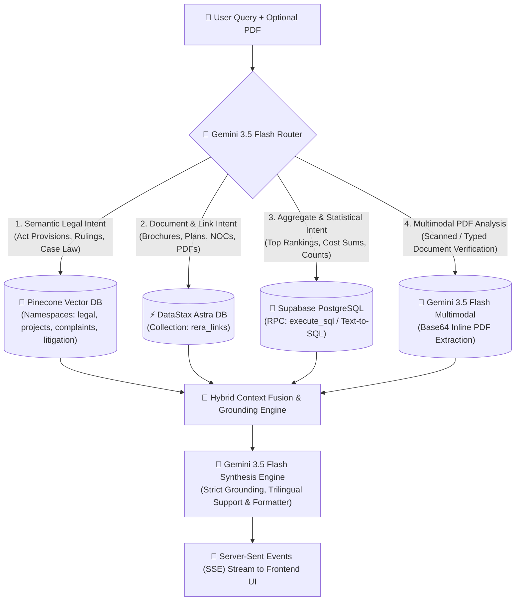

# REAA: Hybrid Agentic RAG Engine for K-RERA

[](https://nextjs.org/)
[](https://www.typescriptlang.org/)
[](https://aistudio.google.com/)
[](https://www.pinecone.io/)
[](https://astra.datastax.com/)
[](https://supabase.com/)
[](https://tailwindcss.com/)

---

## 📌 Overview

**REAA (Real Estate Advisory Agent)** is a domain-specialized, autonomous AI advisory engine engineered for the **Karnataka Real Estate Regulatory Authority (K-RERA)** ecosystem. 

By combining **dense vector retrieval**, **relational Text-to-SQL function calling**, and **native multimodal document vision**, REAA bridges statutory legal grounding with quantitative intelligence across:
- **9,800+** Registered K-RERA Projects
- **52,500+** Consumer & Promoter Complaints
- **16,500+** Land & Project Litigations
- **200,000+** Official Project Documents & Downloadable PDF Links (Sanction Plans, NOCs, Occupancy Certificates)
- Complete statutory corpus of the **Real Estate (Regulation and Development) Act, 2016**, **Karnataka RERA Rules 2017**, and landmark **Supreme Court & High Court Precedents**.

---

## 🏗️ System Architecture: The Multi-Engine Router

REAA employs an intelligent query-classification and function-calling router powered by **Google Gemini 3.5 Flash** that dynamically routes queries across dedicated database engines and multimodal pipelines:



### 1. 🌲 Dense Semantic Search (`Pinecone`)
- **Namespaces**: `rera-legal`, `rera-projects`, `rera-complaints`, `rera-litigation`.
- **Dimensions**: 3,072-dimensional embeddings via `gemini-embedding-001`.
- **Role**: Semantic matching across dense legal circulars, project histories, complaint narratives, and court case summaries. Features dynamic top-K context expansion (12 for legal circulars, 5 for structured records).

### 2. ⚡ Direct Document & PDF Retrieval (`DataStax Astra DB`)
- **Collection**: `rera_links` (Cosine Metric, 3,072 dimensions).
- **Role**: High-throughput semantic retrieval of official government document links, layout plans, commencement certificates (CC), and occupancy certificates (OC) with zero rate limiting.

### 3. 🐘 Statistical & Aggregate Text-to-SQL (`Supabase PostgreSQL`)
- **Tables**: `krera_projects`, `krera_complaints`, `krera_litigations`.
- **Role**: Executed via the `query_krera_sql_database` Gemini tool calling interface. Translates global quantitative queries (*"Top 5 districts with the most projects"*, *"Promoters with >10 complaints"*, *"Total project cost in Bengaluru"*) into optimized SQL `SELECT` statements with in-database aggregation.

### 4. 📄 Multimodal PDF Analysis (`Gemini 3.5 Flash`)
- **Engine**: Native vision and document understanding via `gemini-3.5-flash`.
- **Role**: Directly processes uploaded typed agreements, scanned brochures, and clearance notices. Bypasses external OCR libraries by ingesting raw Base64 buffers to cross-examine developer claims against K-RERA statutory obligations in English, Kannada, and Hindi.

### 5. 🔒 Ephemeral Secure Storage (`pg_cron`)
- **Bucket**: `temp_documents` in Supabase Storage.
- **Role**: Temporary holding area for user-uploaded documents during active consultation sessions. A scheduled `pg_cron` database routine sweeps the bucket every 15 minutes, permanently purging any file older than 1 hour (TTL) to ensure zero data retention liabilities.

---

## ✨ Key Features

- **Dual-Engine Agentic Routing**: Automatically triggers the Supabase SQL tool for quantitative calculations and switches to vector stores for qualitative statutory legal interpretations.
- **Multimodal PDF Analysis**: Upload real estate agreements, statutory clearances, or scanned brochures directly in chat. Native vision extraction supports typed text, scanned handwriting, and multi-language content (English, Kannada, Hindi) without third-party OCR.
- **Ephemeral Secure Storage**: Uploaded files in Supabase Storage (`temp_documents`) are governed by an automated 1-hour Time-to-Live (TTL) deletion cycle via `pg_cron`, ensuring strict user privacy.
- **Premium Monochromatic Interface**: High-performance Uber/Grok-inspired pure black-and-white aesthetic, hardware-accelerated cinematic HTML5 video background with custom logo emblem masking on authentication, and high-contrast electric blue (`text-blue-400`) semantic citation pills.
- **Strict Verbatim Grounding**: Eliminates hallucinations in regulatory numbers, ministry circulars, and case codes by strictly extracting alphanumeric references directly from retrieved context.
- **In-Memory Streaming ETL Pipelines**:
  - `temp_supabase_ingestion/`: High-performance streaming parser with memory-efficient 500-row batching, intra-batch `Map` deduplication, and exponential backoff retry.
  - `temp_astra_ingestion/`: Smart-batching vectorizer chunking project documents into semantic vector groups of 30.
- **Clickable Markdown Hyperlinks & Citations**: Interactive citation drawer and clickable blue links leading directly to official gazettes and K-RERA filings.
- **Real-Time SSE Streaming**: Live status indicators displaying query routing decisions, retrieved citations, and token-by-token advisory generation.

---

## 📂 Project Structure

```bash
ReAA2.0/
├── app/
│   ├── api/
│   │   ├── chat/route.ts      # Main SSE Chat Streaming Endpoint & Multimodal Gemini Pipeline
│   │   └── upload/route.ts    # Secure Fallback Storage Upload for Temporary Documents
│   ├── layout.tsx             # Root layout with Tailwind dark mode & typography support
│   ├── login/page.tsx         # Monochromatic Login with Looping Video Background & Emblem
│   └── page.tsx               # Primary AI Legal Advisory Chat Workspace
├── components/
│   ├── chat/
│   │   ├── ChatArea.tsx       # Main conversation feed container with auto-scroll
│   │   ├── ChatInput.tsx      # Minimalist B&W chat bar, voice dictation, & PDF upload button
│   │   ├── MessageItem.tsx    # Markdown renderer with electric blue links & attachment badges
│   │   └── CitationPill.tsx   # Semantic citation tags with interactive modal triggers
│   └── ui/
│       ├── CitationModal.tsx  # Deep-dive inspector for statutory excerpts and references
│       └── IsometricCity.tsx  # Isometric architectural visualization component
├── lib/
│   ├── astra/
│   │   └── client.ts          # Singleton DataStax Astra DB client
│   ├── rag/
│   │   ├── engine.ts          # Multi-Store Hybrid RAG Engine (Pinecone + Astra DB)
│   │   └── prompts.ts         # Statutory grounding directives & system prompts
│   ├── gemini.ts              # Google Generative AI client (gemini-3.5-flash configuration)
│   └── supabase-service.ts    # Supabase PostgreSQL Text-to-SQL execution engine
├── public/
│   └── Metropolis_constructing_itself_20260913221239.mp4  # Cinematic background asset
├── temp_supabase_ingestion/
│   └── ingest_sql.ts          # Streaming CSV-to-PostgreSQL batch ingestion engine
├── temp_astra_ingestion/
│   └── ingest_astra_links.ts  # Smart-batching CSV-to-Astra DB document vectorizer
├── .env.example               # Environment variables template
└── package.json               # Node.js dependencies and scripts
```

---

## 🚀 Quick Start & Setup Guide

### 1. Prerequisites
- **Node.js**: v18.0.0 or higher
- **npm** or **yarn** / **pnpm**
- **Supabase Project**: With Database, Auth, and `temp_documents` Storage bucket enabled
- **Google Gemini API Key**: With access to `gemini-3.5-flash`

### 2. Clone the Repository
```bash
git clone https://github.com/Virajcreates/ReAA2.0.git
cd ReAA2.0
```

### 3. Install Dependencies
```bash
npm install
```

### 4. Configure Environment Variables
Create a `.env.local` file in the root directory by copying `.env.example`:
```bash
cp .env.example .env.local
```

Fill in your respective API keys:
```env
# Google Gemini API
GEMINI_API_KEY=your_gemini_api_key
GEMINI_CHAT_MODEL=gemini-3.5-flash
GEMINI_EMBEDDING_MODEL=gemini-embedding-001

# Pinecone Vector DB
PINECONE_API_KEY=your_pinecone_api_key
PINECONE_HOST=https://your-pinecone-host.pinecone.io
PINECONE_INDEX=newreaa

# DataStax Astra DB
ASTRA_DB_API_ENDPOINT=https://your-astra-db-endpoint.apps.astra.datastax.com
ASTRA_DB_APPLICATION_TOKEN=AstraCS:your_astra_token
ASTRA_DB_COLLECTION=rera_links

# Supabase PostgreSQL & Storage
SUPABASE_URL=https://your-project.supabase.co
SUPABASE_PUBLISHABLE_KEY=your_supabase_publishable_key
SUPABASE_SERVICE_ROLE_KEY=your_supabase_service_role_key
NEXT_PUBLIC_SUPABASE_URL=https://your-project.supabase.co
NEXT_PUBLIC_SUPABASE_ANON_KEY=your_supabase_publishable_key
```

### 5. Run Database Ingestion (Optional)
To ingest CSV datasets into your databases:

```bash
# Ingest document links into Astra DB
npx tsx temp_astra_ingestion/ingest_astra_links.ts --full

# Ingest projects, complaints, and litigations into Supabase
npx tsx temp_supabase_ingestion/ingest_sql.ts --full
```

### 6. Start the Development Server
```bash
npm run dev
```

Open [http://localhost:3005](http://localhost:3005) (or [http://localhost:3000](http://localhost:3000)) in your browser.

---

## 🧪 Testing & Diagnostics

REAA includes standalone test runners to validate vector and relational queries independently:

```bash
# Test multi-store hybrid vector retrieval (Pinecone + Astra DB)
npx tsx tests/test_links_routing.ts

# Test agentic Text-to-SQL execution against Supabase
npx tsx tests/test_sql_agent.ts
```

---

## 📜 Legal Disclaimer
*REAA is an AI advisory research tool built to assist homebuyers, legal professionals, and real estate researchers in navigating Karnataka Real Estate Regulatory Authority public disclosures, provisions, and judicial precedents. Output generated does not constitute binding formal legal counsel.*

---

## 👨‍💻 Author & Contributions
- **Created by**: [Virajcreates](https://github.com/Virajcreates)
- **Repository**: [https://github.com/Virajcreates/ReAA2.0](https://github.com/Virajcreates/ReAA2.0)
- **License**: MIT
